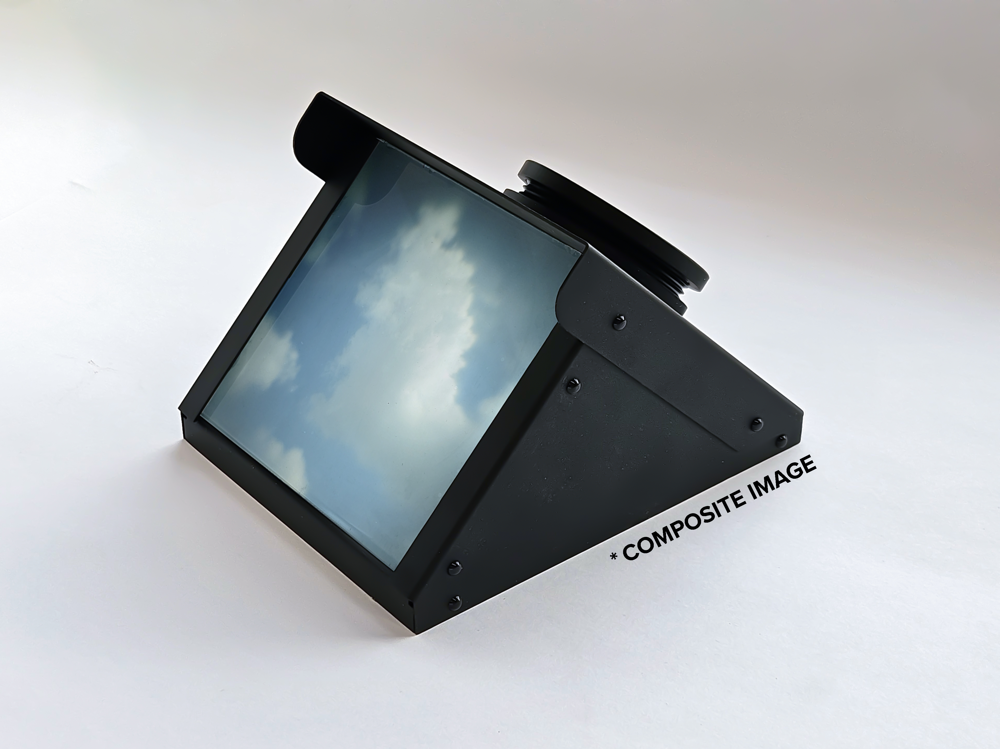

# Wolkenkijker building instructions
Welcome to the Wolkenkijker instruction page! This repository contains all the files you need to build your own Wolkenkijker, or modify it to your liking. The instructions below assume you want to build a perfect copy. However, the Fusion360 file is included so you can customize the design.

## Table of Contents
1. [Bill of Materials](#bill-of-materials)
2. [Manufacture the Aluminium Parts](#manufacture-the-aluminium-parts)
3. [Print the 3D Prints](#print-the-3d-prints)
4. [Grind the Ground Glass](#grind-the-ground-glass)
5. [Assemble Your Wolkenkijker](#assemble-your-wolkenkijker)
6. [Possible Alternative Materials](#possible-alternative-materials)
7. [Contribute](#contribute)

## Bill of materials
- Picture frame glass (min. 100 x 100 mm, thickness 1 mm)
- Silicon carbide grinding powder (400 and 600 grit)
- [Biconvex lens](https://nl.aliexpress.com/item/1005007494613338.html?spm=a2g0o.order_list.order_list_main.26.54b81802VggjWI&gatewayAdapt=glo2nld) (D50F95.5 mm)
- [Fresnel lens](https://nl.aliexpress.com/item/1005008116547795.html?spm=a2g0o.order_list.order_list_main.31.54b81802VggjWI&gatewayAdapt=glo2nld) (focal length 120 mm, dimensions 100 x 100 mm)
- [Front surface mirror](https://nl.aliexpress.com/item/1005004853298387.html?spm=a2g0o.order_list.order_list_main.16.54b81802VggjWI&gatewayAdapt=glo2nld) 123 x 100 mm, thickness 1.1 mm. [This supplier](https://www.aliexpress.com/store/1100386575?spm=a2g0o.detail.0.0.79d4c7iEc7iE3z) makes custom sized mirrors.
- [Push rivets](https://nl.aliexpress.com/item/1005008732939550.html?spm=a2g0o.order_list.order_list_main.21.54b81802VggjWI&gatewayAdapt=glo2nld) (R3535 Black)
- Glass cutter

## Manufacture the aluminium parts
[STEP file for the 1mm aluminium parts](Manufacturing/Sheet%20metal%201mm.step) 

I had the aluminium parts produced by a manufacturer who laser cut, bent, and anodized them. [JLCCNC](https://jlccnc.com/sheet-metal-quote) is fast and affordable. Use 1 mm thick 5052 aluminum, anodized black.

## Print the 3D prints
Download the [3D print files](Manufacturing/3D%20Print/).

The lens assembly looks best printed in resin. I used [JLC3DP](https://jlc3dp.com/) for printing.

## Grind the ground glass
1. Cut the glass to size (100 x 90 mm)
2. Grind the glass following [this video tutorial](https://www.youtube.com/watch?v=RVCxuESAiCw).

⚠️ **Safety Tip**: Wear gloves and eye protection when cutting or grinding glass. 

## Assemble your Wolkenkijker
1. Adhere the mirror to the bottom aluminium plate using your preferred adhesive.
2. Follow the [assembly instructions PDF](Assembly%20manual/Wolkenkijker%20assembly%20instruction.pdf).

## Possible Alternative Materials
- Aluminium parts can be replaced by other sheet materials. The files are based on 1 mm thickness. Cardboard prototypes worked well.
- Ground glass can be substituted with pre-ground glass. Baking sheets were used as placeholders during prototyping.

## Contribute
💡 **Want to contribute?** Fork the repo, submit pull requests, or share your build photos!

---
**Version**: 1.0  
**Last updated**: October 2025
